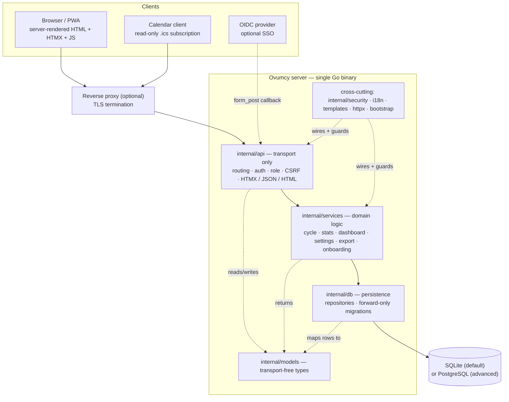
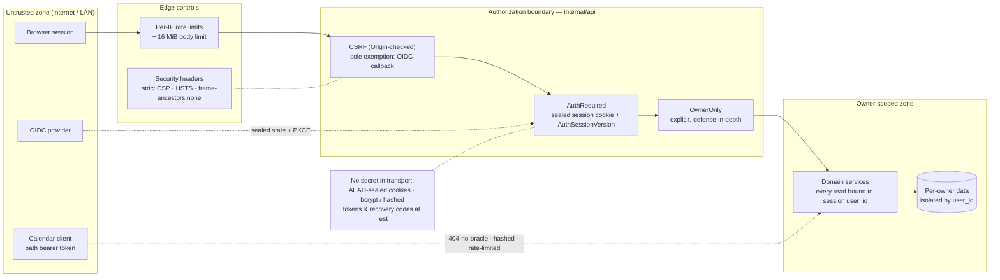
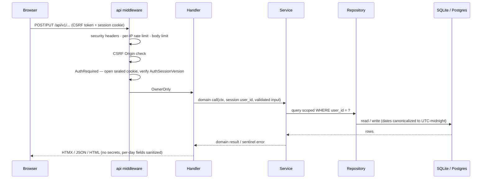

# Architecture &amp; trust model

Ovumcy is a privacy-critical, self-hosted menstrual/fertility tracker that holds
special-category health data. It ships as a **single Go binary** (templates,
locales and static assets embedded via `go:embed`) and is **owner-role-only**:
one instance may host several independent owners (household self-hosting), each
the sole owner of its own data, isolated by `user_id`. There is no viewer or
partner role.

This document complements the deployment topology in the
[README](../README.md#architecture): it shows the **internal layering**, the
**trust boundaries**, and the **lifecycle of a state-mutating request**. The
security controls named here are the test-backed invariants in
[`SECURITY.md`](../SECURITY.md) and their public mirror
[`docs/SECURITY_INVARIANTS.md`](SECURITY_INVARIANTS.md) — this file is a map, not
the source of truth.

## Layered architecture

Strict one-directional layering. Transport never reaches the database; domain
logic never depends on HTTP; persisted types stay transport-free.

- **`internal/api` (transport only).** Request parsing, content negotiation
  (HTML / HTMX partial / JSON), authentication, role and CSRF enforcement, error
  mapping. It never touches the database directly and holds no business logic.
- **`internal/services` (domain logic).** Cycle prediction, stats, dashboard and
  calendar views, settings, export, onboarding. It never imports Fiber or HTTP
  status codes; it returns domain data and sentinel errors.
- **`internal/db` (persistence).** Repositories and forward-only SQL migrations.
  Every per-user query is scoped by `user_id`.
- **`internal/models` (transport-free types).** Shared domain types with no
  serialization or HTTP concerns; `/api/v1/*` DTOs are separate api-layer types.
- **Cross-cutting** (`internal/security`, `i18n`, `templates`, `httpx`,
  `bootstrap`): AEAD sealing and token logic, localization, HTMX status-markup
  wrappers, and one dependency-wiring recipe shared by production and tests.

## Trust boundaries

The security-relevant view. Everything left of the authorization boundary is
untrusted; every read of per-user data on the right is scoped to the
authenticated session's `user_id`.

Load-bearing invariants (see [`docs/SECURITY_INVARIANTS.md`](SECURITY_INVARIANTS.md)):

- **Privacy boundary.** No account, surface, or export may expose another
  account's data. A resource id from the request is always combined with the
  session `user_id`, never trusted alone.
- **Endpoint defense-in-depth.** Every state-mutating `/api/v1/*` endpoint
  declares `OwnerOnly` **and** is CSRF-protected. The single CSRF exemption is
  `POST /auth/oidc/callback`, protected by the sealed one-time state cookie.
- **No secret in transport.** Secrets, auth/recovery/reset tokens, recovery
  codes and passwords never appear in URLs, JSON, HTML or logs. The one
  sanctioned carve-out is the read-only calendar-feed capability token (hashed at
  rest, one-click-revocable, 404-no-oracle, rate-limited, log-redacted).
- **Session invalidation.** Any credential or security-posture change bumps
  `AuthSessionVersion` in the same atomic update, so stale sessions stop working.
- **Sealed cookies.** All auth/recovery/reset/flash cookies are AEAD-sealed
  values, never plaintext or base64(JSON).
- **Medical safety.** Every ovulation and next-period surface carries an estimate
  qualifier plus a persistent "not medical advice or a method of contraception"
  disclaimer.
- **Re-auth for erasure.** Clear-data and delete-account require a fresh
  current-password confirmation on top of session + role + CSRF.

## Lifecycle of a state-mutating request

How a write (e.g. `PUT /api/v1/days/:date`) crosses the boundary. Controls run in
order; any failure short-circuits before domain logic.

## Data isolation &amp; storage

- **One engine per deployment.** SQLite is the baseline default; PostgreSQL is
  the advanced option (`DB_DRIVER=postgres` + `DATABASE_URL`). Both are covered by
  boot, migrations and tests. There is no automatic SQLite→Postgres migration.
- **Owner isolation is enforced at the repository layer**, not just in handlers:
  repository methods take `user_id` as an explicit parameter and every per-user
  query pins `WHERE user_id = ?`. Cross-owner access is a tested denial
  (`symptoms_idor_regression_test.go`); the legacy non-owner role is rejected
  separately.
- **Rate-limit and attempt-limiter state is in-memory and process-local**, valid
  only under the single-instance contract — horizontal scaling would need an
  external shared store.

## Deployment topology

The runtime and deployment paths (baseline single instance, the preferred
reverse-proxy stack, backups, and secrets) are documented in the
[README](../README.md#architecture) and [`docs/self-hosted.md`](self-hosted.md).
The pushed image is a shell-free `FROM scratch` runtime built from the repo-root
`Dockerfile`; every published image is Cosign-signed and carries a SLSA
build-provenance attestation and an SBOM.
