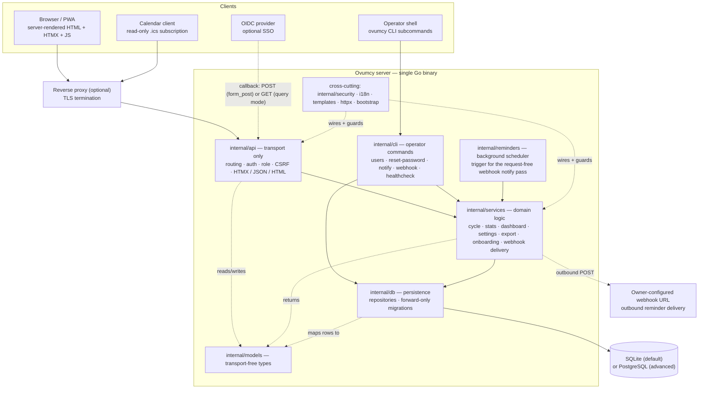
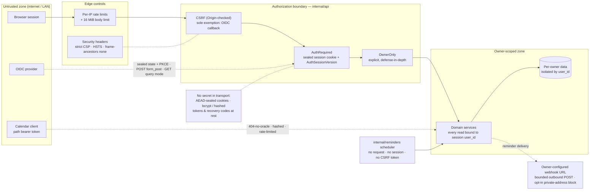
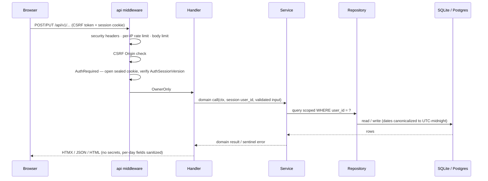

# Architecture &amp; trust model

Ovumcy is a privacy-critical, self-hosted menstrual/fertility tracker that holds
special-category health data. It ships as a **single Go binary** (templates,
locales and static assets embedded via `go:embed`) and is **owner-role-only**:
one instance may host several independent owners (household self-hosting), each
the sole owner of its own data, isolated by `user_id`. There is no viewer or
partner role.

This document complements the deployment topology in the
[README](../README.md#architecture): it shows the **internal layering**, the
**trust boundaries**, and the **lifecycle of a state-mutating request**. The
security controls named here are the test-backed invariants in
[`SECURITY.md`](../SECURITY.md) and their public mirror
[`docs/SECURITY_INVARIANTS.md`](SECURITY_INVARIANTS.md) — this file is a map, not
the source of truth.

## Layered architecture

Strict one-directional layering. Transport never reaches the database; domain
logic never depends on HTTP; persisted types stay transport-free. All three are
checked mechanically against the whole tree by `scripts/archcheck`, which CI
runs on every change; test files are outside the check, because a fixture
legitimately reaches across a layer boundary to prove the layer below it.

```mermaid
flowchart TB
    subgraph clients["Clients"]
        browser["Browser / PWA<br/>server-rendered HTML + HTMX + JS"]
        ical["Calendar client<br/>read-only .ics subscription"]
        idp["OIDC provider<br/>optional SSO"]
        operator["Operator shell<br/>ovumcy CLI subcommands"]
    end

    proxy["Reverse proxy (optional)<br/>TLS termination"]

    subgraph app["Ovumcy server — single Go binary"]
        direction TB
        api["internal/api — transport only<br/>routing · auth · role · CSRF · HTMX / JSON / HTML"]
        cli["internal/cli — operator commands<br/>users · reset-password · notify · webhook · healthcheck"]
        reminders["internal/reminders — background scheduler<br/>trigger for the request-free webhook notify pass"]
        services["internal/services — domain logic<br/>cycle · stats · dashboard · settings · export · onboarding · webhook delivery"]
        db["internal/db — persistence<br/>repositories · forward-only migrations"]
        models["internal/models — transport-free types"]
        cross["cross-cutting: internal/security · i18n · templates · httpx · bootstrap"]
    end

    store[("SQLite (default)<br/>or PostgreSQL (advanced)")]
    hook["Owner-configured webhook URL<br/>outbound reminder delivery"]

    browser --> proxy
    ical --> proxy
    proxy --> api
    idp -. "callback: POST (form_post) or GET (query mode)" .-> api
    operator --> cli
    api --> services
    cli --> services
    cli --> db
    reminders --> services
    services --> db
    services -. "outbound POST" .-> hook
    db --> store
    api -. "reads/writes" .-> models
    services -. "returns" .-> models
    db -. "maps rows to" .-> models
    cross -. "wires + guards" .-> api
    cross -. "wires + guards" .-> services
```

- **`internal/api` (transport only).** Request parsing, content negotiation
  (HTML / HTMX partial / JSON), authentication, role and CSRF enforcement, error
  mapping. It never touches the database directly and holds no business logic.
- **`internal/services` (domain logic).** Cycle prediction, stats, dashboard and
  calendar views, settings, export, onboarding. It never imports Fiber or HTTP
  status codes; it returns domain data and sentinel errors.
- **`internal/db` (persistence).** Repositories and forward-only SQL migrations.
  Every per-user query is scoped by `user_id`.
- **`internal/models` (transport-free types).** Shared domain types with no
  serialization or HTTP concerns; `/api/v1/*` DTOs are separate api-layer types.
- **Cross-cutting** (`internal/security`, `i18n`, `templates`, `httpx`,
  `bootstrap`): AEAD sealing and token logic, localization, HTMX status-markup
  wrappers, and one dependency-wiring recipe shared by production and tests.
- **`internal/reminders` (background scheduler).** The one caller that reaches the
  domain layer with neither a request nor an operator behind it: a lifecycle-tied
  trigger, started from `cmd/ovumcy` when the off-by-default
  `REMINDER_SCHEDULER_ENABLED` is on, that decides *when* to run the daily webhook
  notify pass. The pass itself — listing owners, deciding due reminders,
  delivering, and writing each per-reminder watermark — stays in
  `internal/services`, and the outbound POST it makes is the only call the app
  places that no one asked it for; everything else it dials (OIDC discovery, JWKS,
  token exchange) happens inside a request it is answering. Because the pass runs
  outside a request it has no session and no CSRF token: its owner scoping comes
  from the same per-`user_id` repository calls the request path uses.
- **`internal/cli` (operator commands).** The second entry point of the binary
  (`ovumcy users`, `reset-password`, `notify`, `webhook`, `healthcheck`). It is
  not transport and does not pass through the authorization boundary below —
  it reaches `internal/services` and `internal/db` directly, and is gated by
  shell or container access to the host instead. Operator use is documented in
  the [README](../README.md#architecture) and
  [`docs/self-hosted.md`](self-hosted.md).

`internal/apideps` (the dependency-wiring struct and ports shared by the server
and the CLI) and `internal/testdb` (a PostgreSQL test harness) are wiring rather
than layers and are deliberately left off this map.

## Trust boundaries

The security-relevant view. Everything left of the authorization boundary is
untrusted; every read of per-user data on the right is scoped to the
authenticated session's `user_id`.

```mermaid
flowchart LR
    subgraph untrusted["Untrusted zone (internet / LAN)"]
        ub["Browser session"]
        uc["Calendar client<br/>path bearer token"]
        ui["OIDC provider"]
    end

    subgraph edge["Edge controls"]
        rl["Per-IP rate limits<br/>+ 16 MiB body limit"]
        hdr["Security headers<br/>strict CSP · HSTS · frame-ancestors none"]
    end

    subgraph authz["Authorization boundary — internal/api"]
        csrf["CSRF (Origin-checked)<br/>sole exemption: OIDC callback"]
        auth["AuthRequired<br/>sealed session cookie + AuthSessionVersion"]
        owner["OwnerOnly<br/>explicit, defense-in-depth"]
    end

    subgraph trusted["Owner-scoped zone"]
        domain["Domain services<br/>every read bound to session user_id"]
        data[("Per-owner data<br/>isolated by user_id")]
    end

    secrets["No secret in transport:<br/>AEAD-sealed cookies · bcrypt / hashed<br/>tokens &amp; recovery codes at rest"]
    sched["internal/reminders scheduler<br/>no request · no session · no CSRF token"]
    hook["Owner-configured webhook URL<br/>bounded outbound POST · opt-in private-address block"]

    ub --> rl --> csrf --> auth --> owner --> domain --> data
    ui -. "sealed state + PKCE · POST form_post · GET query mode" .-> auth
    uc -. "404-no-oracle · hashed · rate-limited" .-> domain
    sched --> domain
    domain -. "reminder delivery" .-> hook
    hdr -.- csrf
    secrets -.- auth
```

Load-bearing invariants (see [`docs/SECURITY_INVARIANTS.md`](SECURITY_INVARIANTS.md)):

- **Privacy boundary.** No account, surface, or export may expose another
  account's data. A resource id from the request is always combined with the
  session `user_id`, never trusted alone.
- **Endpoint defense-in-depth.** Every state-mutating `/api/v1/*` endpoint is
  CSRF-protected — the pre-session ones (register, login, password reset)
  included, since the CSRF middleware is mounted globally, ahead of routing, and
  does not care whether a session exists. Every such endpoint that sits behind
  `AuthRequired` **additionally** declares `OwnerOnly`; the endpoints that run
  before any session exists have no role to enforce, and that exclusion set —
  which applies to `OwnerOnly` alone, never to CSRF — is named in full in
  [`docs/SECURITY_INVARIANTS.md`](SECURITY_INVARIANTS.md) rather than restated
  here. The single CSRF exemption is the OIDC callback — `POST
  /auth/oidc/callback`, plus `GET` on the same path under
  `OIDC_RESPONSE_MODE=query`, a safe method the middleware never validates —
  protected by the sealed one-time state cookie.
- **No usable secret in transport.** Passwords, auth/recovery/reset tokens and
  stored secrets never appear in URLs, JSON, or logs. The exception ledger is
  [`docs/SECURITY_INVARIANTS.md`](SECURITY_INVARIANTS.md)'s, not this file's:
  the read-only calendar-feed capability token (hashed at rest,
  one-click-revocable, 404-no-oracle, rate-limited, log-redacted) is the one
  exception for a value usable on its own; the TOTP enrollment seed rendered
  into the enrollment page's HTML is the second, narrower declared exception
  (minted fresh per visit, inert until the first code verifies); and the
  one-time HTML reveals — the recovery code and the feed subscribe URL — are
  sanctioned shown-once displays, consumed server-side and never re-rendered.
- **Session invalidation.** Any credential or security-posture change bumps
  `AuthSessionVersion` in the same atomic update, so stale sessions stop working.
- **Sealed cookies.** All auth/recovery/reset/flash cookies are AEAD-sealed
  values, never plaintext or base64(JSON).
- **Medical safety.** Every ovulation and next-period surface carries an estimate
  qualifier plus a persistent "not medical advice or a method of contraception"
  disclaimer.
- **Re-auth for erasure.** Clear-data and delete-account require fresh
  re-authentication on top of session + role + CSRF: the current local
  password, or — only for an account that has no local password — a fresh
  purpose-bound OIDC step-up. The check never downgrades for an account that
  has a password.

## Lifecycle of a state-mutating request

How a write (e.g. `PUT /api/v1/days/:date`) crosses the boundary. Controls run in
order; any failure short-circuits before domain logic.

```mermaid
sequenceDiagram
    participant B as Browser
    participant MW as api middleware
    participant H as Handler
    participant S as Service
    participant R as Repository
    participant DB as SQLite / Postgres

    B->>MW: POST/PUT /api/v1/... (CSRF token + session cookie)
    MW->>MW: security headers · per-IP rate limit · body limit
    MW->>MW: CSRF Origin check
    MW->>MW: AuthRequired — open sealed cookie, verify AuthSessionVersion
    MW->>H: OwnerOnly
    H->>S: domain call(ctx, session user_id, validated input)
    S->>R: query scoped WHERE user_id = ?
    R->>DB: read / write (dates canonicalized to UTC-midnight)
    DB-->>S: rows
    S-->>H: domain result / sentinel error
    H-->>B: HTMX / JSON / HTML (no secrets, per-day fields sanitized)
```

## Data isolation &amp; storage

- **One engine per deployment.** SQLite is the baseline default; PostgreSQL is
  the advanced option (`DB_DRIVER=postgres` + `DATABASE_URL`). Both are covered by
  boot, migrations and tests. There is no automatic SQLite→Postgres migration.
- **Owner isolation is enforced at the repository layer**, not just in handlers:
  repository methods take `user_id` as an explicit parameter and every per-user
  query pins `WHERE user_id = ?`. Cross-owner access is a tested denial
  (`symptoms_idor_regression_test.go`); the legacy non-owner role is rejected
  separately.
- **Rate-limit and attempt-limiter state is in-memory and process-local**, valid
  only under the single-instance contract — horizontal scaling would need an
  external shared store.

## Deployment topology

The runtime and deployment paths (baseline single instance, the preferred
reverse-proxy stack, backups, and secrets) are documented in the
[README](../README.md#architecture) and [`docs/self-hosted.md`](self-hosted.md).
The pushed image is a shell-free `FROM scratch` runtime built from the repo-root
`Dockerfile`; every published image is Cosign-signed and carries a SLSA
build-provenance attestation and an SBOM. Publication waits for the commit's own
CI run and scans the exact image before pushing it, so a tag or `:latest` never
reaches the registry ahead of the checks for the commit it was built from.
